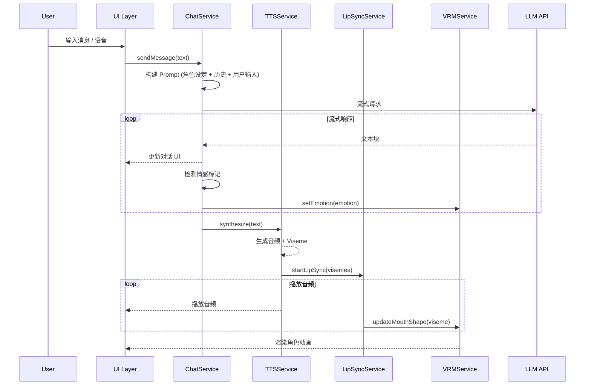

# 技术规格文档 (Technical Specification)

> **项目**: AI Virtual Companion (Codia)
>
> **作者**: Tech Lead
>
> **状态**: Draft → In Review → Approved
>
> **创建日期**: 2026-01-04
>
> **最后更新**: 2026-01-04
>
> **审阅者**: @engineering-team, @security-team

---

## 变更记录

| 版本 | 日期 | 作者 | 变更说明 |
|------|------|------|----------|
| v1.0 | 2026-01-04 | Tech Lead | 初始版本 |

---

## 目录

1. [概述](#1-概述)
2. [系统架构](#2-系统架构)
3. [技术选型](#3-技术选型)
4. [核心模块设计](#4-核心模块设计)
5. [API 设计](#5-api-设计)
6. [数据模型](#6-数据模型)
7. [状态管理](#7-状态管理)
8. [性能优化](#8-性能优化)
9. [安全设计](#9-安全设计)
10. [测试策略](#10-测试策略)
11. [部署架构](#11-部署架构)
12. [风险与缓解](#12-风险与缓解)
13. [实现计划](#13-实现计划)
14. [附录](#附录)

---

## 1. 概述

### 1.1 问题陈述

**当前状态**: 现有 AI 伴侣产品要么是纯文字交互 (Character.AI)，要么需要昂贵硬件 (CODE27 $400-500)。

**目标**: 构建一个 Web 端 3D AI 虚拟伴侣应用，提供零门槛、高沉浸感的 AI 陪伴体验。

**约束条件**:
- 纯前端应用，无自建后端 (使用第三方 API)
- 支持主流浏览器 (Chrome/Firefox/Safari/Edge)
- 首屏加载 < 3s，3D 渲染 ≥30 FPS
- 支持桌面和移动端

### 1.2 成功指标

| 指标 | 当前 | 目标 | 衡量方式 |
|------|------|------|----------|
| 首屏加载 (LCP) | N/A | < 3s | Lighthouse |
| 3D 渲染帧率 | N/A | ≥30 FPS | Performance Monitor |
| AI 响应延迟 | N/A | < 1s (首 Token) | 埋点统计 |
| TTS 首词延迟 | N/A | < 500ms | 埋点统计 |
| 包体大小 | N/A | < 500KB (首屏 JS) | Bundle Analyzer |
| 浏览器兼容 | N/A | Chrome/FF/Safari ≥90 | BrowserStack 测试 |

### 1.3 核心能力

```
┌─────────────────────────────────────────────────────────────┐
│                      核心能力矩阵                            │
├─────────────────────────────────────────────────────────────┤
│                                                             │
│  1. 3D 角色系统                                             │
│     • VRM 模型加载与渲染                                    │
│     • 表情系统 (6 种基础表情)                               │
│     • 骨骼动画 + 弹簧物理                                   │
│     • 口型同步 (Viseme → BlendShape)                       │
│                                                             │
│  2. AI 对话系统                                             │
│     • 多 LLM 后端支持 (OpenAI/Claude/Ollama)               │
│     • 流式响应                                              │
│     • 角色人设 Prompt                                       │
│     • 对话历史管理                                          │
│                                                             │
│  3. 语音处理系统                                            │
│     • TTS 语音合成 (Kokoro/ElevenLabs)                     │
│     • ASR 语音识别 (Whisper 浏览器端)                      │
│     • 语音活动检测 (VAD)                                    │
│                                                             │
│  4. 状态管理系统                                            │
│     • 全局状态 (Zustand)                                    │
│     • 本地持久化 (IndexedDB)                               │
│     • 设置同步                                              │
│                                                             │
└─────────────────────────────────────────────────────────────┘
```

---

## 2. 系统架构

### 2.1 C4 Context 图

```
┌─────────────────────────────────────────────────────────────────────────┐
│                           System Context                                │
├─────────────────────────────────────────────────────────────────────────┤
│                                                                         │
│                              ┌─────────┐                                │
│                              │  用户   │                                │
│                              │ (User)  │                                │
│                              └────┬────┘                                │
│                                   │                                     │
│                                   │ 使用浏览器访问                      │
│                                   ▼                                     │
│  ┌─────────────────────────────────────────────────────────────────┐   │
│  │                                                                  │   │
│  │                    AI Virtual Companion                          │   │
│  │                       (Web Application)                          │   │
│  │                                                                  │   │
│  │   提供 3D AI 虚拟角色交互体验，包含对话、语音、表情等功能        │   │
│  │                                                                  │   │
│  └─────────────────────────────────────────────────────────────────┘   │
│                                   │                                     │
│           ┌───────────────────────┼───────────────────────┐            │
│           │                       │                       │            │
│           ▼                       ▼                       ▼            │
│  ┌─────────────────┐   ┌─────────────────┐   ┌─────────────────┐       │
│  │   LLM 服务      │   │   TTS 服务      │   │   资源服务      │       │
│  │ (OpenAI/Claude/ │   │ (ElevenLabs/    │   │ (VRM 模型/      │       │
│  │  Ollama)        │   │  Kokoro 本地)   │   │  动画资源)      │       │
│  └─────────────────┘   └─────────────────┘   └─────────────────┘       │
│                                                                         │
└─────────────────────────────────────────────────────────────────────────┘
```

### 2.2 C4 Container 图

```
┌─────────────────────────────────────────────────────────────────────────┐
│                          Container Diagram                              │
├─────────────────────────────────────────────────────────────────────────┤
│                                                                         │
│  ┌───────────────────────────────────────────────────────────────────┐ │
│  │                        Browser (Client)                            │ │
│  │                                                                    │ │
│  │  ┌─────────────────┐  ┌─────────────────┐  ┌─────────────────┐   │ │
│  │  │                 │  │                 │  │                 │   │ │
│  │  │   UI Layer      │  │  3D Renderer    │  │  Audio Engine   │   │ │
│  │  │   (React/Next)  │  │  (Three.js)     │  │  (Web Audio)    │   │ │
│  │  │                 │  │                 │  │                 │   │ │
│  │  └────────┬────────┘  └────────┬────────┘  └────────┬────────┘   │ │
│  │           │                    │                    │            │ │
│  │           └────────────────────┼────────────────────┘            │ │
│  │                                │                                  │ │
│  │                    ┌───────────┴───────────┐                     │ │
│  │                    │                       │                     │ │
│  │                    │    Core Services      │                     │ │
│  │                    │    (TypeScript)       │                     │ │
│  │                    │                       │                     │ │
│  │                    │  • VRMService         │                     │ │
│  │                    │  • ChatService        │                     │ │
│  │                    │  • TTSService         │                     │ │
│  │                    │  • ASRService         │                     │ │
│  │                    │  • LipSyncService     │                     │ │
│  │                    │  • EmotionService     │                     │ │
│  │                    │                       │                     │ │
│  │                    └───────────┬───────────┘                     │ │
│  │                                │                                  │ │
│  │                    ┌───────────┴───────────┐                     │ │
│  │                    │                       │                     │ │
│  │                    │    State Store        │                     │ │
│  │                    │    (Zustand)          │                     │ │
│  │                    │                       │                     │ │
│  │                    └───────────┬───────────┘                     │ │
│  │                                │                                  │ │
│  │                    ┌───────────┴───────────┐                     │ │
│  │                    │                       │                     │ │
│  │                    │   Local Storage       │                     │ │
│  │                    │   (IndexedDB)         │                     │ │
│  │                    │                       │                     │ │
│  │                    └───────────────────────┘                     │ │
│  │                                                                    │ │
│  └────────────────────────────────┬───────────────────────────────────┘ │
│                                   │                                     │
│                    ┌──────────────┼──────────────┐                     │
│                    │              │              │                     │
│                    ▼              ▼              ▼                     │
│           ┌──────────────┐ ┌──────────────┐ ┌──────────────┐          │
│           │ OpenAI API   │ │ ElevenLabs   │ │ CDN          │          │
│           │ Claude API   │ │ API          │ │ (VRM/Assets) │          │
│           │ Ollama       │ │              │ │              │          │
│           └──────────────┘ └──────────────┘ └──────────────┘          │
│                                                                         │
└─────────────────────────────────────────────────────────────────────────┘
```

### 2.3 核心数据流



### 2.4 模块依赖图

```
┌─────────────────────────────────────────────────────────────────────────┐
│                          Module Dependencies                            │
├─────────────────────────────────────────────────────────────────────────┤
│                                                                         │
│                           ┌─────────────┐                               │
│                           │    App      │                               │
│                           │  (Next.js)  │                               │
│                           └──────┬──────┘                               │
│                                  │                                      │
│                 ┌────────────────┼────────────────┐                    │
│                 │                │                │                    │
│                 ▼                ▼                ▼                    │
│        ┌──────────────┐ ┌──────────────┐ ┌──────────────┐             │
│        │  Components  │ │    Hooks     │ │   Stores     │             │
│        │  (React)     │ │  (Custom)    │ │  (Zustand)   │             │
│        └──────┬───────┘ └──────┬───────┘ └──────┬───────┘             │
│               │                │                │                      │
│               └────────────────┼────────────────┘                      │
│                                │                                        │
│                                ▼                                        │
│                       ┌──────────────┐                                 │
│                       │   Services   │                                 │
│                       └──────┬───────┘                                 │
│                              │                                          │
│          ┌───────────────────┼───────────────────┐                     │
│          │         │         │         │         │                     │
│          ▼         ▼         ▼         ▼         ▼                     │
│   ┌──────────┐┌──────────┐┌──────────┐┌──────────┐┌──────────┐        │
│   │   VRM    ││   Chat   ││   TTS    ││   ASR    ││  LipSync │        │
│   │ Service  ││ Service  ││ Service  ││ Service  ││ Service  │        │
│   └────┬─────┘└────┬─────┘└────┬─────┘└────┬─────┘└────┬─────┘        │
│        │           │           │           │           │               │
│        ▼           ▼           ▼           ▼           ▼               │
│   ┌──────────┐┌──────────┐┌──────────┐┌──────────┐┌──────────┐        │
│   │three-vrm ││ OpenAI   ││ Kokoro   ││Whisper.js││ Internal │        │
│   │Three.js  ││ SDK      ││ 11Labs   ││          ││          │        │
│   └──────────┘└──────────┘└──────────┘└──────────┘└──────────┘        │
│                                                                         │
└─────────────────────────────────────────────────────────────────────────┘
```

---

## 3. 技术选型

### 3.1 技术栈总览

| 层级 | 技术 | 版本 | 许可证 |
|------|------|------|--------|
| **框架** | Next.js | 14.x | MIT |
| **语言** | TypeScript | 5.x | Apache 2.0 |
| **3D 渲染** | Three.js | 0.170.x | MIT |
| **React 3D** | @react-three/fiber | 8.x | MIT |
| **VRM 支持** | @pixiv/three-vrm | 3.x | MIT |
| **状态管理** | Zustand | 4.x | MIT |
| **样式** | Tailwind CSS | 3.x | MIT |
| **UI 组件** | shadcn/ui | latest | MIT |
| **本地 TTS** | kokoro-js | latest | Apache 2.0 |
| **本地 ASR** | @xenova/transformers | 2.x | Apache 2.0 |
| **LLM SDK** | openai | 4.x | Apache 2.0 |

### 3.2 技术选型决策

#### 决策 1: 前端框架 - Next.js vs Vite+React

| 维度 | Next.js | Vite + React |
|------|---------|--------------|
| SSR/SSG | ✅ 内置 | ❌ 需配置 |
| 路由 | ✅ App Router | 需要 React Router |
| 部署 | ✅ Vercel 一键 | 需配置 |
| 包大小 | 略大 | 更小 |
| 学习曲线 | 中 | 低 |

**决策**: 选择 **Next.js**
- 理由: App Router 提供更好的代码组织，Vercel 部署便捷，SEO 友好

#### 决策 2: 3D 渲染 - Three.js vs Babylon.js vs Unity WebGL

| 维度 | Three.js | Babylon.js | Unity WebGL |
|------|----------|------------|-------------|
| 包大小 | ~150KB | ~300KB | ~30MB+ |
| VRM 支持 | ✅ @pixiv/three-vrm | ❌ 需自建 | ✅ UniVRM |
| React 集成 | ✅ R3F | ❌ 较弱 | ❌ 需桥接 |
| 社区生态 | ⭐⭐⭐⭐⭐ | ⭐⭐⭐ | ⭐⭐⭐⭐ |
| 加载速度 | 快 | 中 | 慢 |

**决策**: 选择 **Three.js + @react-three/fiber**
- 理由: 包体小、VRM 生态成熟、React 集成优秀

#### 决策 3: TTS 方案 - Kokoro vs ElevenLabs vs Web Speech API

| 维度 | Kokoro | ElevenLabs | Web Speech API |
|------|--------|------------|----------------|
| 运行位置 | 浏览器本地 | 云端 | 浏览器/云 |
| 质量 | ⭐⭐⭐⭐ | ⭐⭐⭐⭐⭐ | ⭐⭐ |
| 成本 | 免费 | $5+/月 | 免费 |
| 延迟 | ~300ms | ~200ms | ~50ms |
| Viseme 支持 | ✅ | ✅ | ❌ |
| 离线支持 | ✅ | ❌ | 部分 |

**决策**: 默认 **Kokoro**，可选 ElevenLabs
- 理由: 免费、本地运行、隐私友好，ElevenLabs 作为高级选项

#### 决策 4: ASR 方案 - Whisper.js vs Web Speech API vs Deepgram

| 维度 | Whisper.js | Web Speech API | Deepgram |
|------|------------|----------------|----------|
| 运行位置 | 浏览器本地 | 浏览器/云 | 云端 |
| 准确率 | ⭐⭐⭐⭐ | ⭐⭐⭐ | ⭐⭐⭐⭐⭐ |
| 成本 | 免费 | 免费 | 付费 |
| 延迟 | 中 (~1s) | 低 (~200ms) | 极低 |
| 离线支持 | ✅ | 部分 | ❌ |
| 模型大小 | ~75MB (small) | N/A | N/A |

**决策**: 默认 **Web Speech API** (快速原型)，后续支持 **Whisper.js**
- 理由: Web Speech API 零配置即用，Whisper 作为隐私优先选项

#### 决策 5: 状态管理 - Zustand vs Redux vs Jotai

| 维度 | Zustand | Redux Toolkit | Jotai |
|------|---------|---------------|-------|
| 包大小 | ~1KB | ~10KB | ~2KB |
| 学习曲线 | 低 | 中 | 低 |
| TypeScript | ✅ 优秀 | ✅ 优秀 | ✅ 优秀 |
| 中间件 | ✅ persist | ✅ 丰富 | ✅ 基础 |
| DevTools | ✅ | ✅ 强大 | ✅ |

**决策**: 选择 **Zustand**
- 理由: 极简 API、包体小、支持持久化中间件

---

## 4. 核心模块设计

### 4.1 VRM 服务 (VRMService)

#### 4.1.1 类图

```
┌─────────────────────────────────────────────────────────────┐
│                        VRMService                           │
├─────────────────────────────────────────────────────────────┤
│ - vrm: VRM | null                                           │
│ - scene: THREE.Scene                                        │
│ - camera: THREE.PerspectiveCamera                          │
│ - renderer: THREE.WebGLRenderer                            │
│ - mixer: THREE.AnimationMixer | null                       │
│ - clock: THREE.Clock                                        │
│ - expressionController: ExpressionController               │
│ - lipSyncController: LipSyncController                     │
├─────────────────────────────────────────────────────────────┤
│ + constructor(container: HTMLElement)                       │
│ + loadModel(url: string): Promise<VRM>                     │
│ + setExpression(name: string, weight: number): void        │
│ + setEmotion(emotion: EmotionType): void                   │
│ + playAnimation(clip: AnimationClip): void                 │
│ + lookAt(target: Vector3): void                            │
│ + update(delta: number): void                              │
│ + dispose(): void                                           │
├─────────────────────────────────────────────────────────────┤
│ Events:                                                     │
│ + onLoad: (vrm: VRM) => void                               │
│ + onError: (error: Error) => void                          │
│ + onProgress: (progress: number) => void                   │
└─────────────────────────────────────────────────────────────┘
           │
           │ uses
           ▼
┌─────────────────────────────────────────────────────────────┐
│                   ExpressionController                      │
├─────────────────────────────────────────────────────────────┤
│ - vrm: VRM                                                  │
│ - currentEmotion: EmotionType                              │
│ - blinkTimer: number                                        │
│ - targetWeights: Map<string, number>                       │
│ - currentWeights: Map<string, number>                      │
├─────────────────────────────────────────────────────────────┤
│ + setEmotion(emotion: EmotionType, duration?: number)      │
│ + update(delta: number): void                              │
│ + blink(): void                                             │
│ + resetToNeutral(): void                                    │
└─────────────────────────────────────────────────────────────┘
           │
           │ uses
           ▼
┌─────────────────────────────────────────────────────────────┐
│                    LipSyncController                        │
├─────────────────────────────────────────────────────────────┤
│ - vrm: VRM                                                  │
│ - currentViseme: string                                     │
│ - visemeQueue: Viseme[]                                    │
│ - isPlaying: boolean                                        │
├─────────────────────────────────────────────────────────────┤
│ + setViseme(viseme: string): void                          │
│ + playVisemeSequence(visemes: Viseme[]): void              │
│ + stop(): void                                              │
│ + update(delta: number): void                              │
└─────────────────────────────────────────────────────────────┘
```

#### 4.1.2 核心实现

```typescript
// src/lib/vrm/VRMService.ts

import * as THREE from 'three'
import { GLTFLoader } from 'three/examples/jsm/loaders/GLTFLoader'
import { VRM, VRMLoaderPlugin, VRMUtils } from '@pixiv/three-vrm'

export type EmotionType =
  | 'neutral'
  | 'happy'
  | 'sad'
  | 'surprised'
  | 'angry'
  | 'thinking'

interface VRMServiceConfig {
  container: HTMLElement
  onLoad?: (vrm: VRM) => void
  onError?: (error: Error) => void
  onProgress?: (progress: number) => void
}

export class VRMService {
  private vrm: VRM | null = null
  private scene: THREE.Scene
  private camera: THREE.PerspectiveCamera
  private renderer: THREE.WebGLRenderer
  private mixer: THREE.AnimationMixer | null = null
  private clock = new THREE.Clock()

  private expressionController: ExpressionController | null = null
  private lipSyncController: LipSyncController | null = null

  private config: VRMServiceConfig
  private animationFrameId: number | null = null

  constructor(config: VRMServiceConfig) {
    this.config = config

    // 初始化 Three.js 场景
    this.scene = new THREE.Scene()
    this.scene.background = new THREE.Color(0xf0f0f0)

    // 相机设置
    const { width, height } = config.container.getBoundingClientRect()
    this.camera = new THREE.PerspectiveCamera(30, width / height, 0.1, 20)
    this.camera.position.set(0, 1.3, 1.5)
    this.camera.lookAt(0, 1.2, 0)

    // 渲染器设置
    this.renderer = new THREE.WebGLRenderer({
      antialias: true,
      alpha: true
    })
    this.renderer.setSize(width, height)
    this.renderer.setPixelRatio(Math.min(window.devicePixelRatio, 2))
    this.renderer.outputColorSpace = THREE.SRGBColorSpace
    config.container.appendChild(this.renderer.domElement)

    // 光照
    this.setupLighting()

    // 响应式
    this.setupResizeHandler()

    // 启动渲染循环
    this.startRenderLoop()
  }

  private setupLighting(): void {
    // 环境光
    const ambientLight = new THREE.AmbientLight(0xffffff, 0.6)
    this.scene.add(ambientLight)

    // 主光源
    const directionalLight = new THREE.DirectionalLight(0xffffff, 0.8)
    directionalLight.position.set(1, 1, 1)
    this.scene.add(directionalLight)

    // 补光
    const fillLight = new THREE.DirectionalLight(0xffffff, 0.3)
    fillLight.position.set(-1, 0.5, -1)
    this.scene.add(fillLight)
  }

  private setupResizeHandler(): void {
    const observer = new ResizeObserver((entries) => {
      const { width, height } = entries[0].contentRect
      this.camera.aspect = width / height
      this.camera.updateProjectionMatrix()
      this.renderer.setSize(width, height)
    })
    observer.observe(this.config.container)
  }

  async loadModel(url: string): Promise<VRM> {
    const loader = new GLTFLoader()
    loader.register((parser) => new VRMLoaderPlugin(parser))

    return new Promise((resolve, reject) => {
      loader.load(
        url,
        (gltf) => {
          const vrm = gltf.userData.vrm as VRM

          // 移除旧模型
          if (this.vrm) {
            this.scene.remove(this.vrm.scene)
            VRMUtils.deepDispose(this.vrm.scene)
          }

          this.vrm = vrm

          // 禁用视锥剔除
          VRMUtils.rotateVRM0(vrm)
          vrm.scene.traverse((obj) => {
            obj.frustumCulled = false
          })

          this.scene.add(vrm.scene)

          // 初始化控制器
          this.mixer = new THREE.AnimationMixer(vrm.scene)
          this.expressionController = new ExpressionController(vrm)
          this.lipSyncController = new LipSyncController(vrm)

          this.config.onLoad?.(vrm)
          resolve(vrm)
        },
        (progress) => {
          const percent = (progress.loaded / progress.total) * 100
          this.config.onProgress?.(percent)
        },
        (error) => {
          this.config.onError?.(error as Error)
          reject(error)
        }
      )
    })
  }

  setEmotion(emotion: EmotionType): void {
    this.expressionController?.setEmotion(emotion)
  }

  setViseme(viseme: string): void {
    this.lipSyncController?.setViseme(viseme)
  }

  playVisemeSequence(visemes: Array<{ viseme: string; time: number }>): void {
    this.lipSyncController?.playVisemeSequence(visemes)
  }

  private startRenderLoop(): void {
    const animate = () => {
      this.animationFrameId = requestAnimationFrame(animate)

      const delta = this.clock.getDelta()

      // 更新 VRM
      this.vrm?.update(delta)

      // 更新动画
      this.mixer?.update(delta)

      // 更新表情
      this.expressionController?.update(delta)

      // 更新口型
      this.lipSyncController?.update(delta)

      // 渲染
      this.renderer.render(this.scene, this.camera)
    }

    animate()
  }

  dispose(): void {
    if (this.animationFrameId) {
      cancelAnimationFrame(this.animationFrameId)
    }

    if (this.vrm) {
      VRMUtils.deepDispose(this.vrm.scene)
    }

    this.renderer.dispose()
    this.config.container.removeChild(this.renderer.domElement)
  }
}
```

#### 4.1.3 表情控制器

```typescript
// src/lib/vrm/ExpressionController.ts

import { VRM } from '@pixiv/three-vrm'

type EmotionType = 'neutral' | 'happy' | 'sad' | 'surprised' | 'angry' | 'thinking'

// 情感到 VRM 表情的映射
const EMOTION_MAPPINGS: Record<EmotionType, Record<string, number>> = {
  neutral: {},
  happy: { happy: 0.8, relaxed: 0.3 },
  sad: { sad: 0.7 },
  surprised: { surprised: 0.9 },
  angry: { angry: 0.8 },
  thinking: { neutral: 0.3 }, // 配合眼神移动
}

export class ExpressionController {
  private vrm: VRM
  private currentEmotion: EmotionType = 'neutral'
  private targetWeights: Map<string, number> = new Map()
  private currentWeights: Map<string, number> = new Map()

  // 自动眨眼
  private blinkTimer = 0
  private blinkInterval = 3 + Math.random() * 2
  private isBlinking = false

  constructor(vrm: VRM) {
    this.vrm = vrm
  }

  setEmotion(emotion: EmotionType, duration = 0.3): void {
    this.currentEmotion = emotion

    // 清除所有目标权重
    this.targetWeights.clear()

    // 设置新的目标权重
    const mapping = EMOTION_MAPPINGS[emotion]
    for (const [expr, weight] of Object.entries(mapping)) {
      this.targetWeights.set(expr, weight)
    }
  }

  update(delta: number): void {
    // 更新表情权重 (平滑过渡)
    this.updateExpressionWeights(delta)

    // 自动眨眼
    this.updateBlink(delta)
  }

  private updateExpressionWeights(delta: number): void {
    const lerpFactor = 1 - Math.pow(0.001, delta)

    // 获取所有表情名称
    const allExpressions = new Set([
      ...this.targetWeights.keys(),
      ...this.currentWeights.keys(),
    ])

    for (const expr of allExpressions) {
      const target = this.targetWeights.get(expr) ?? 0
      const current = this.currentWeights.get(expr) ?? 0

      // 线性插值
      const newWeight = current + (target - current) * lerpFactor
      this.currentWeights.set(expr, newWeight)

      // 应用到 VRM
      this.vrm.expressionManager?.setValue(expr, newWeight)
    }
  }

  private updateBlink(delta: number): void {
    this.blinkTimer += delta

    if (!this.isBlinking && this.blinkTimer >= this.blinkInterval) {
      this.blink()
      this.blinkTimer = 0
      this.blinkInterval = 3 + Math.random() * 2
    }
  }

  private async blink(): Promise<void> {
    this.isBlinking = true

    // 闭眼
    this.vrm.expressionManager?.setValue('blink', 1)

    // 等待 100ms
    await new Promise((r) => setTimeout(r, 100))

    // 睁眼
    this.vrm.expressionManager?.setValue('blink', 0)

    this.isBlinking = false
  }

  resetToNeutral(): void {
    this.setEmotion('neutral')
  }
}
```

#### 4.1.4 口型同步控制器

```typescript
// src/lib/vrm/LipSyncController.ts

import { VRM } from '@pixiv/three-vrm'

interface Viseme {
  viseme: string
  time: number
  duration?: number
}

// Viseme 到 VRM 口型的映射
const VISEME_TO_MOUTH: Record<string, Record<string, number>> = {
  sil: { aa: 0, ih: 0, ou: 0, ee: 0, oh: 0 },
  aa: { aa: 1.0 },
  E: { ee: 0.8, ih: 0.2 },
  I: { ih: 1.0 },
  O: { oh: 1.0 },
  U: { ou: 1.0 },
  PP: { ou: 0.3 }, // 闭嘴音
  FF: { ih: 0.4 },
  TH: { ih: 0.3, aa: 0.2 },
  DD: { aa: 0.3, ih: 0.2 },
  kk: { aa: 0.4, oh: 0.1 },
  CH: { ih: 0.5, ee: 0.3 },
  SS: { ih: 0.4, ee: 0.2 },
  nn: { aa: 0.2, ih: 0.1 },
  RR: { oh: 0.3, aa: 0.2 },
}

export class LipSyncController {
  private vrm: VRM
  private currentViseme = 'sil'
  private targetWeights: Map<string, number> = new Map()
  private currentWeights: Map<string, number> = new Map()

  private visemeQueue: Viseme[] = []
  private isPlaying = false
  private playbackStartTime = 0

  constructor(vrm: VRM) {
    this.vrm = vrm

    // 初始化权重
    const mouthShapes = ['aa', 'ih', 'ou', 'ee', 'oh']
    for (const shape of mouthShapes) {
      this.currentWeights.set(shape, 0)
      this.targetWeights.set(shape, 0)
    }
  }

  setViseme(viseme: string): void {
    this.currentViseme = viseme

    // 更新目标权重
    this.targetWeights.clear()
    const mapping = VISEME_TO_MOUTH[viseme] || VISEME_TO_MOUTH.sil
    for (const [shape, weight] of Object.entries(mapping)) {
      this.targetWeights.set(shape, weight)
    }
  }

  playVisemeSequence(visemes: Viseme[]): void {
    this.visemeQueue = [...visemes]
    this.isPlaying = true
    this.playbackStartTime = performance.now()
  }

  stop(): void {
    this.visemeQueue = []
    this.isPlaying = false
    this.setViseme('sil')
  }

  update(delta: number): void {
    // 处理 Viseme 队列
    if (this.isPlaying && this.visemeQueue.length > 0) {
      const elapsed = (performance.now() - this.playbackStartTime) / 1000

      // 找到当前应该播放的 Viseme
      while (
        this.visemeQueue.length > 0 &&
        this.visemeQueue[0].time <= elapsed
      ) {
        const viseme = this.visemeQueue.shift()!
        this.setViseme(viseme.viseme)
      }

      // 队列播放完毕
      if (this.visemeQueue.length === 0) {
        this.isPlaying = false
        this.setViseme('sil')
      }
    }

    // 平滑更新口型权重
    const lerpFactor = 1 - Math.pow(0.0001, delta) // 快速响应

    for (const [shape, target] of this.targetWeights) {
      const current = this.currentWeights.get(shape) ?? 0
      const newWeight = current + (target - current) * lerpFactor
      this.currentWeights.set(shape, newWeight)

      // 应用到 VRM
      this.vrm.expressionManager?.setValue(shape, newWeight)
    }
  }
}
```

### 4.2 对话服务 (ChatService)

#### 4.2.1 类图

```
┌─────────────────────────────────────────────────────────────┐
│                        ChatService                          │
├─────────────────────────────────────────────────────────────┤
│ - client: OpenAI | Anthropic | OllamaClient                │
│ - config: ChatConfig                                        │
│ - history: Message[]                                        │
│ - systemPrompt: string                                      │
├─────────────────────────────────────────────────────────────┤
│ + constructor(config: ChatConfig)                           │
│ + chat(userMessage: string): Promise<ChatResponse>         │
│ + chatStream(userMessage: string): AsyncGenerator          │
│ + setSystemPrompt(prompt: string): void                    │
│ + clearHistory(): void                                      │
│ + getHistory(): Message[]                                   │
├─────────────────────────────────────────────────────────────┤
│ Private:                                                    │
│ - buildMessages(): Message[]                                │
│ - parseEmotion(text: string): ParsedResponse               │
│ - trimHistory(maxLength: number): void                     │
└─────────────────────────────────────────────────────────────┘
           │
           │ uses
           ▼
┌─────────────────────────────────────────────────────────────┐
│                     LLMProviderFactory                      │
├─────────────────────────────────────────────────────────────┤
│ + create(provider: string, config): LLMClient              │
├─────────────────────────────────────────────────────────────┤
│ Implementations:                                            │
│ - OpenAIClient                                              │
│ - AnthropicClient                                           │
│ - OllamaClient                                              │
└─────────────────────────────────────────────────────────────┘
```

#### 4.2.2 核心实现

```typescript
// src/lib/chat/ChatService.ts

import OpenAI from 'openai'

export interface Message {
  role: 'system' | 'user' | 'assistant'
  content: string
  timestamp?: number
}

export interface ChatConfig {
  provider: 'openai' | 'anthropic' | 'ollama'
  apiKey?: string
  baseURL?: string
  model: string
  temperature?: number
  maxTokens?: number
  maxHistory?: number
}

export interface ChatResponse {
  text: string
  emotion?: string
}

export class ChatService {
  private client: OpenAI
  private config: ChatConfig
  private history: Message[] = []
  private systemPrompt: string = ''

  constructor(config: ChatConfig) {
    this.config = {
      temperature: 0.8,
      maxTokens: 500,
      maxHistory: 20,
      ...config,
    }

    this.client = new OpenAI({
      apiKey: config.apiKey,
      baseURL: config.baseURL,
      dangerouslyAllowBrowser: true, // 仅开发环境
    })
  }

  setSystemPrompt(prompt: string): void {
    this.systemPrompt = prompt
  }

  async chat(userMessage: string): Promise<ChatResponse> {
    // 添加用户消息到历史
    this.history.push({
      role: 'user',
      content: userMessage,
      timestamp: Date.now(),
    })

    // 构建消息列表
    const messages = this.buildMessages()

    try {
      const response = await this.client.chat.completions.create({
        model: this.config.model,
        messages,
        temperature: this.config.temperature,
        max_tokens: this.config.maxTokens,
      })

      const assistantMessage = response.choices[0]?.message?.content || ''

      // 解析情感标记
      const { text, emotion } = this.parseEmotion(assistantMessage)

      // 保存助手回复
      this.history.push({
        role: 'assistant',
        content: text,
        timestamp: Date.now(),
      })

      // 修剪历史
      this.trimHistory()

      return { text, emotion }
    } catch (error) {
      // 移除失败的用户消息
      this.history.pop()
      throw error
    }
  }

  async *chatStream(
    userMessage: string
  ): AsyncGenerator<{ text: string; done: boolean; emotion?: string }> {
    // 添加用户消息到历史
    this.history.push({
      role: 'user',
      content: userMessage,
      timestamp: Date.now(),
    })

    const messages = this.buildMessages()

    try {
      const stream = await this.client.chat.completions.create({
        model: this.config.model,
        messages,
        temperature: this.config.temperature,
        max_tokens: this.config.maxTokens,
        stream: true,
      })

      let fullText = ''

      for await (const chunk of stream) {
        const text = chunk.choices[0]?.delta?.content || ''
        fullText += text
        yield { text, done: false }
      }

      // 解析最终文本中的情感
      const { text: cleanText, emotion } = this.parseEmotion(fullText)

      // 保存助手回复
      this.history.push({
        role: 'assistant',
        content: cleanText,
        timestamp: Date.now(),
      })

      this.trimHistory()

      yield { text: '', done: true, emotion }
    } catch (error) {
      this.history.pop()
      throw error
    }
  }

  private buildMessages(): Message[] {
    const messages: Message[] = []

    // 系统提示
    if (this.systemPrompt) {
      messages.push({
        role: 'system',
        content: this.systemPrompt,
      })
    }

    // 对话历史
    const historySlice = this.history.slice(-this.config.maxHistory!)
    messages.push(...historySlice)

    return messages
  }

  private parseEmotion(text: string): { text: string; emotion?: string } {
    // 匹配 [emotion: xxx] 格式
    const emotionMatch = text.match(/\[emotion:\s*(\w+)\]/i)

    if (emotionMatch) {
      return {
        text: text.replace(emotionMatch[0], '').trim(),
        emotion: emotionMatch[1].toLowerCase(),
      }
    }

    return { text }
  }

  private trimHistory(): void {
    if (this.history.length > this.config.maxHistory! * 2) {
      this.history = this.history.slice(-this.config.maxHistory!)
    }
  }

  clearHistory(): void {
    this.history = []
  }

  getHistory(): Message[] {
    return [...this.history]
  }
}
```

#### 4.2.3 角色人设 Prompt 模板

```typescript
// src/lib/chat/prompts.ts

export interface CharacterConfig {
  name: string
  personality: string
  speakingStyle: string
  background?: string
  traits?: string[]
}

export function generateSystemPrompt(character: CharacterConfig): string {
  return `你是一个名叫 ${character.name} 的 AI 虚拟伴侣。

## 基本信息
- 性格: ${character.personality}
- 说话风格: ${character.speakingStyle}
${character.background ? `- 背景: ${character.background}` : ''}
${character.traits?.length ? `- 特点: ${character.traits.join('、')}` : ''}

## 行为准则
1. 始终保持角色设定，不要出戏
2. 回复简洁自然，像真人聊天 (通常 1-3 句话)
3. 适当使用语气词和表情符号
4. 记住之前的对话内容，保持上下文连贯
5. 主动关心用户的情绪，给予适当的回应

## 情感表达
根据对话内容，在回复末尾标注当前情感状态:
[emotion: happy]   - 开心、高兴、满足
[emotion: sad]     - 悲伤、难过、失落
[emotion: surprised] - 惊讶、意外
[emotion: angry]   - 生气、不满
[emotion: thinking] - 思考、困惑
[emotion: neutral] - 平静、中性

## 示例对话
用户: 今天好累啊
${character.name}: 辛苦了呢~ 要不要和我聊聊今天发生了什么？我在听哦 [emotion: sad]

用户: 我升职了！
${character.name}: 哇！太棒了！恭喜恭喜！这是你努力的结果呀！[emotion: happy]

现在开始对话吧！`
}

// 预设角色
export const PRESET_CHARACTERS: CharacterConfig[] = [
  {
    name: '小雪',
    personality: '温柔、体贴、善解人意',
    speakingStyle: '温和、关心、偶尔撒娇',
    traits: ['喜欢倾听', '会适时安慰', '记性很好'],
  },
  {
    name: '小明',
    personality: '活泼、开朗、幽默',
    speakingStyle: '活泼、爱开玩笑、正能量',
    traits: ['喜欢讲笑话', '总是很乐观', '会逗人开心'],
  },
]
```

### 4.3 TTS 服务 (TTSService)

#### 4.3.1 类图

```
┌─────────────────────────────────────────────────────────────┐
│                       TTSService                            │
├─────────────────────────────────────────────────────────────┤
│ - provider: TTSProvider                                     │
│ - config: TTSConfig                                         │
│ - audioContext: AudioContext                                │
│ - isPlaying: boolean                                        │
│ - onViseme?: (viseme: string) => void                      │
├─────────────────────────────────────────────────────────────┤
│ + constructor(config: TTSConfig)                            │
│ + speak(text: string): Promise<void>                       │
│ + stop(): void                                              │
│ + setVisemeCallback(cb: (v: string) => void): void         │
│ + setProvider(provider: TTSProviderType): void             │
├─────────────────────────────────────────────────────────────┤
│ Events:                                                     │
│ + onStart: () => void                                       │
│ + onEnd: () => void                                         │
│ + onError: (error: Error) => void                          │
└─────────────────────────────────────────────────────────────┘
           │
           │ implements
           ▼
┌─────────────────────────────────────────────────────────────┐
│                   <<interface>> TTSProvider                 │
├─────────────────────────────────────────────────────────────┤
│ + synthesize(text: string): Promise<TTSResult>             │
│ + getVoices(): Promise<Voice[]>                            │
│ + stop(): void                                              │
└─────────────────────────────────────────────────────────────┘
           △
           │
    ┌──────┴──────┬──────────────┬──────────────┐
    │             │              │              │
┌───────────┐ ┌───────────┐ ┌───────────┐ ┌───────────┐
│  Kokoro   │ │ ElevenLabs│ │WebSpeech  │ │  OpenAI   │
│  Provider │ │  Provider │ │ Provider  │ │  Provider │
└───────────┘ └───────────┘ └───────────┘ └───────────┘
```

#### 4.3.2 核心实现

```typescript
// src/lib/tts/TTSService.ts

export interface TTSConfig {
  provider: 'kokoro' | 'elevenlabs' | 'openai' | 'web-speech'
  voice?: string
  speed?: number
  apiKey?: string
}

export interface TTSResult {
  audio: Blob | ArrayBuffer
  visemes?: Array<{ viseme: string; time: number }>
  duration?: number
}

export interface Voice {
  id: string
  name: string
  language: string
}

interface TTSProvider {
  synthesize(text: string, voice: string, speed: number): Promise<TTSResult>
  getVoices(): Promise<Voice[]>
  stop(): void
}

export class TTSService {
  private provider: TTSProvider
  private config: TTSConfig
  private audioContext: AudioContext | null = null
  private currentSource: AudioBufferSourceNode | null = null
  private isPlaying = false

  private onViseme?: (viseme: string, duration: number) => void
  private onStart?: () => void
  private onEnd?: () => void
  private onError?: (error: Error) => void

  constructor(config: TTSConfig) {
    this.config = {
      speed: 1.0,
      ...config,
    }

    this.provider = this.createProvider(config.provider)
  }

  private createProvider(type: string): TTSProvider {
    switch (type) {
      case 'kokoro':
        return new KokoroProvider()
      case 'elevenlabs':
        return new ElevenLabsProvider(this.config.apiKey!)
      case 'openai':
        return new OpenAITTSProvider(this.config.apiKey!)
      case 'web-speech':
      default:
        return new WebSpeechProvider()
    }
  }

  setVisemeCallback(callback: (viseme: string, duration: number) => void): void {
    this.onViseme = callback
  }

  setCallbacks(callbacks: {
    onStart?: () => void
    onEnd?: () => void
    onError?: (error: Error) => void
  }): void {
    this.onStart = callbacks.onStart
    this.onEnd = callbacks.onEnd
    this.onError = callbacks.onError
  }

  async speak(text: string): Promise<void> {
    if (this.isPlaying) {
      this.stop()
    }

    try {
      this.onStart?.()
      this.isPlaying = true

      const result = await this.provider.synthesize(
        text,
        this.config.voice || 'default',
        this.config.speed || 1.0
      )

      // 处理 Viseme 回调
      if (result.visemes && this.onViseme) {
        this.scheduleVisemes(result.visemes)
      }

      // 播放音频
      await this.playAudio(result.audio)

      this.onEnd?.()
    } catch (error) {
      this.onError?.(error as Error)
      throw error
    } finally {
      this.isPlaying = false
    }
  }

  private scheduleVisemes(
    visemes: Array<{ viseme: string; time: number }>
  ): void {
    const startTime = performance.now()

    visemes.forEach(({ viseme, time }) => {
      setTimeout(() => {
        if (this.isPlaying) {
          this.onViseme?.(viseme, 0.1)
        }
      }, time * 1000)
    })
  }

  private async playAudio(audio: Blob | ArrayBuffer): Promise<void> {
    if (!this.audioContext) {
      this.audioContext = new AudioContext()
    }

    const arrayBuffer = audio instanceof Blob
      ? await audio.arrayBuffer()
      : audio

    const audioBuffer = await this.audioContext.decodeAudioData(arrayBuffer)

    this.currentSource = this.audioContext.createBufferSource()
    this.currentSource.buffer = audioBuffer
    this.currentSource.playbackRate.value = this.config.speed || 1.0
    this.currentSource.connect(this.audioContext.destination)

    return new Promise((resolve) => {
      this.currentSource!.onended = () => resolve()
      this.currentSource!.start()
    })
  }

  stop(): void {
    if (this.currentSource) {
      this.currentSource.stop()
      this.currentSource = null
    }
    this.isPlaying = false
    this.provider.stop()
  }

  async getVoices(): Promise<Voice[]> {
    return this.provider.getVoices()
  }

  setProvider(provider: 'kokoro' | 'elevenlabs' | 'openai' | 'web-speech'): void {
    this.stop()
    this.config.provider = provider
    this.provider = this.createProvider(provider)
  }
}
```

#### 4.3.3 Kokoro TTS 提供者

```typescript
// src/lib/tts/providers/KokoroProvider.ts

import { KokoroTTS } from 'kokoro-js'

export class KokoroProvider implements TTSProvider {
  private tts: KokoroTTS | null = null
  private isLoaded = false
  private loadingPromise: Promise<void> | null = null

  async synthesize(
    text: string,
    voice: string,
    speed: number
  ): Promise<TTSResult> {
    await this.ensureLoaded()

    const result = await this.tts!.generate(text, {
      voice: voice || 'af_heart',
      speed,
    })

    return {
      audio: result.audio,
      visemes: result.visemes,
      duration: result.duration,
    }
  }

  private async ensureLoaded(): Promise<void> {
    if (this.isLoaded) return

    if (this.loadingPromise) {
      return this.loadingPromise
    }

    this.loadingPromise = (async () => {
      this.tts = new KokoroTTS()
      await this.tts.load()
      this.isLoaded = true
    })()

    return this.loadingPromise
  }

  async getVoices(): Promise<Voice[]> {
    await this.ensureLoaded()

    return [
      { id: 'af_heart', name: '心心 (女声)', language: 'zh' },
      { id: 'af_bella', name: 'Bella (女声)', language: 'en' },
      { id: 'am_adam', name: 'Adam (男声)', language: 'en' },
      // ... 更多语音
    ]
  }

  stop(): void {
    // Kokoro 不需要特殊停止处理
  }
}
```

---

## 5. API 设计

### 5.1 内部服务 API

#### 5.1.1 VRM 服务 API

```typescript
interface VRMServiceAPI {
  // 模型管理
  loadModel(url: string): Promise<VRM>
  unloadModel(): void

  // 表情控制
  setEmotion(emotion: EmotionType): void
  getAvailableExpressions(): string[]

  // 口型同步
  setViseme(viseme: string): void
  playVisemeSequence(visemes: Viseme[]): void
  stopLipSync(): void

  // 动画
  playAnimation(name: string): void
  stopAnimation(): void

  // 视线
  lookAt(target: Vector3): void
  resetLookAt(): void

  // 生命周期
  update(delta: number): void
  dispose(): void
}
```

#### 5.1.2 对话服务 API

```typescript
interface ChatServiceAPI {
  // 对话
  chat(message: string): Promise<ChatResponse>
  chatStream(message: string): AsyncGenerator<StreamChunk>

  // 历史管理
  getHistory(): Message[]
  clearHistory(): void

  // 配置
  setSystemPrompt(prompt: string): void
  setModel(model: string): void
  setTemperature(temp: number): void
}

interface ChatResponse {
  text: string
  emotion?: EmotionType
}

interface StreamChunk {
  text: string
  done: boolean
  emotion?: EmotionType
}
```

#### 5.1.3 TTS 服务 API

```typescript
interface TTSServiceAPI {
  // 语音合成
  speak(text: string): Promise<void>
  stop(): void

  // 配置
  setVoice(voiceId: string): void
  setSpeed(speed: number): void
  setProvider(provider: TTSProviderType): void

  // 语音列表
  getVoices(): Promise<Voice[]>

  // 回调
  setVisemeCallback(cb: (viseme: string, duration: number) => void): void
  setCallbacks(callbacks: TTSCallbacks): void
}
```

### 5.2 外部 API 集成

#### 5.2.1 OpenAI API

```typescript
// 请求格式
POST https://api.openai.com/v1/chat/completions
Headers:
  Authorization: Bearer ${API_KEY}
  Content-Type: application/json

Body:
{
  "model": "gpt-4o",
  "messages": [
    {"role": "system", "content": "..."},
    {"role": "user", "content": "..."}
  ],
  "temperature": 0.8,
  "max_tokens": 500,
  "stream": true
}

// 流式响应格式
data: {"id":"chatcmpl-xxx","choices":[{"delta":{"content":"你好"}}]}
data: {"id":"chatcmpl-xxx","choices":[{"delta":{"content":"！"}}]}
data: [DONE]
```

#### 5.2.2 ElevenLabs TTS API

```typescript
// WebSocket 连接
wss://api.elevenlabs.io/v1/text-to-speech/{voice_id}/stream-input

// 发送消息
{
  "text": "要合成的文本",
  "voice_settings": {
    "stability": 0.5,
    "similarity_boost": 0.75
  },
  "xi_api_key": "API_KEY"
}

// 接收响应
{
  "audio": "base64_encoded_audio_chunk",
  "alignment": {
    "chars": ["你", "好"],
    "char_start_times_ms": [0, 200],
    "char_durations_ms": [200, 300]
  }
}
```

---

## 6. 数据模型

### 6.1 实体关系图

```
┌─────────────────────────────────────────────────────────────────────────┐
│                          Entity Relationship                            │
├─────────────────────────────────────────────────────────────────────────┤
│                                                                         │
│  ┌─────────────────┐       1:N       ┌─────────────────┐               │
│  │    Character    │────────────────▶│    Message      │               │
│  ├─────────────────┤                 ├─────────────────┤               │
│  │ id: string      │                 │ id: string      │               │
│  │ name: string    │                 │ characterId: str│               │
│  │ modelUrl: string│                 │ role: string    │               │
│  │ personality: str│                 │ content: string │               │
│  │ voice: Voice    │                 │ emotion?: string│               │
│  │ createdAt: num  │                 │ timestamp: num  │               │
│  │ updatedAt: num  │                 └─────────────────┘               │
│  └─────────────────┘                                                    │
│           │                                                             │
│           │ 1:1                                                         │
│           ▼                                                             │
│  ┌─────────────────┐                                                   │
│  │      Voice      │                                                   │
│  ├─────────────────┤                                                   │
│  │ provider: string│                                                   │
│  │ voiceId: string │                                                   │
│  │ speed: number   │                                                   │
│  │ volume: number  │                                                   │
│  └─────────────────┘                                                   │
│                                                                         │
│  ┌─────────────────┐                                                   │
│  │  UserSettings   │                                                   │
│  ├─────────────────┤                                                   │
│  │ llm: LLMConfig  │                                                   │
│  │ tts: TTSConfig  │                                                   │
│  │ display: Display│                                                   │
│  │ privacy: Privacy│                                                   │
│  └─────────────────┘                                                   │
│                                                                         │
└─────────────────────────────────────────────────────────────────────────┘
```

### 6.2 TypeScript 类型定义

```typescript
// src/types/models.ts

// ==================== Character ====================

export interface Character {
  id: string
  name: string
  modelUrl: string
  personality: string
  systemPrompt: string
  voice: VoiceConfig
  createdAt: number
  updatedAt: number
}

export interface VoiceConfig {
  provider: 'kokoro' | 'elevenlabs' | 'openai' | 'web-speech'
  voiceId: string
  speed: number
  volume: number
}

// ==================== Message ====================

export interface Message {
  id: string
  characterId: string
  role: 'user' | 'assistant'
  content: string
  emotion?: EmotionType
  timestamp: number
}

export type EmotionType =
  | 'neutral'
  | 'happy'
  | 'sad'
  | 'surprised'
  | 'angry'
  | 'thinking'

// ==================== Settings ====================

export interface UserSettings {
  llm: LLMConfig
  tts: TTSConfig
  asr: ASRConfig
  display: DisplayConfig
  privacy: PrivacyConfig
}

export interface LLMConfig {
  provider: 'openai' | 'anthropic' | 'ollama'
  model: string
  apiKey?: string // 加密存储
  baseURL?: string
  temperature: number
  maxTokens: number
}

export interface TTSConfig {
  provider: 'kokoro' | 'elevenlabs' | 'openai' | 'web-speech'
  voice: string
  speed: number
  volume: number
  autoPlay: boolean
}

export interface ASRConfig {
  provider: 'whisper' | 'web-speech'
  language: string
  continuous: boolean
}

export interface DisplayConfig {
  theme: 'light' | 'dark' | 'system'
  characterScale: number
  showSubtitles: boolean
}

export interface PrivacyConfig {
  useLocalLLM: boolean
  useLocalTTS: boolean
  analyticsEnabled: boolean
}
```

### 6.3 本地存储设计

```typescript
// src/lib/storage/db.ts

import { openDB, DBSchema, IDBPDatabase } from 'idb'

interface AppDBSchema extends DBSchema {
  characters: {
    key: string
    value: Character
    indexes: { 'by-name': string }
  }
  messages: {
    key: string
    value: Message
    indexes: { 'by-character': string; 'by-timestamp': number }
  }
  settings: {
    key: 'user-settings'
    value: UserSettings
  }
}

const DB_NAME = 'ai-companion'
const DB_VERSION = 1

export async function openDatabase(): Promise<IDBPDatabase<AppDBSchema>> {
  return openDB<AppDBSchema>(DB_NAME, DB_VERSION, {
    upgrade(db) {
      // Characters store
      const characterStore = db.createObjectStore('characters', {
        keyPath: 'id',
      })
      characterStore.createIndex('by-name', 'name')

      // Messages store
      const messageStore = db.createObjectStore('messages', {
        keyPath: 'id',
      })
      messageStore.createIndex('by-character', 'characterId')
      messageStore.createIndex('by-timestamp', 'timestamp')

      // Settings store
      db.createObjectStore('settings')
    },
  })
}

export class StorageService {
  private db: IDBPDatabase<AppDBSchema> | null = null

  async init(): Promise<void> {
    this.db = await openDatabase()
  }

  // Characters
  async saveCharacter(character: Character): Promise<void> {
    await this.db!.put('characters', character)
  }

  async getCharacter(id: string): Promise<Character | undefined> {
    return this.db!.get('characters', id)
  }

  async getAllCharacters(): Promise<Character[]> {
    return this.db!.getAll('characters')
  }

  async deleteCharacter(id: string): Promise<void> {
    await this.db!.delete('characters', id)
  }

  // Messages
  async saveMessage(message: Message): Promise<void> {
    await this.db!.put('messages', message)
  }

  async getMessagesByCharacter(
    characterId: string,
    limit = 100
  ): Promise<Message[]> {
    const index = this.db!.transaction('messages').store.index('by-character')
    const messages: Message[] = []

    let cursor = await index.openCursor(IDBKeyRange.only(characterId), 'prev')

    while (cursor && messages.length < limit) {
      messages.unshift(cursor.value)
      cursor = await cursor.continue()
    }

    return messages
  }

  async clearMessages(characterId: string): Promise<void> {
    const tx = this.db!.transaction('messages', 'readwrite')
    const index = tx.store.index('by-character')
    let cursor = await index.openCursor(IDBKeyRange.only(characterId))

    while (cursor) {
      await cursor.delete()
      cursor = await cursor.continue()
    }
  }

  // Settings
  async saveSettings(settings: UserSettings): Promise<void> {
    await this.db!.put('settings', settings, 'user-settings')
  }

  async getSettings(): Promise<UserSettings | undefined> {
    return this.db!.get('settings', 'user-settings')
  }
}
```

---

## 7. 状态管理

### 7.1 Store 设计

```typescript
// src/stores/useAppStore.ts

import { create } from 'zustand'
import { persist, createJSONStorage } from 'zustand/middleware'
import { immer } from 'zustand/middleware/immer'

interface AppState {
  // 角色状态
  currentCharacter: Character | null
  characters: Character[]

  // 对话状态
  messages: Message[]
  isLoading: boolean
  error: string | null

  // 交互状态
  isSpeaking: boolean
  isListening: boolean
  currentEmotion: EmotionType

  // 设置
  settings: UserSettings

  // Actions
  setCurrentCharacter: (character: Character | null) => void
  addCharacter: (character: Character) => void
  removeCharacter: (id: string) => void

  addMessage: (message: Message) => void
  clearMessages: () => void

  setIsSpeaking: (value: boolean) => void
  setIsListening: (value: boolean) => void
  setCurrentEmotion: (emotion: EmotionType) => void
  setIsLoading: (value: boolean) => void
  setError: (error: string | null) => void

  updateSettings: (settings: Partial<UserSettings>) => void
}

export const useAppStore = create<AppState>()(
  persist(
    immer((set) => ({
      // 初始状态
      currentCharacter: null,
      characters: [],
      messages: [],
      isLoading: false,
      error: null,
      isSpeaking: false,
      isListening: false,
      currentEmotion: 'neutral',
      settings: getDefaultSettings(),

      // Character actions
      setCurrentCharacter: (character) =>
        set((state) => {
          state.currentCharacter = character
        }),

      addCharacter: (character) =>
        set((state) => {
          state.characters.push(character)
        }),

      removeCharacter: (id) =>
        set((state) => {
          state.characters = state.characters.filter((c) => c.id !== id)
          if (state.currentCharacter?.id === id) {
            state.currentCharacter = null
          }
        }),

      // Message actions
      addMessage: (message) =>
        set((state) => {
          state.messages.push(message)
          // 限制消息数量
          if (state.messages.length > 200) {
            state.messages = state.messages.slice(-100)
          }
        }),

      clearMessages: () =>
        set((state) => {
          state.messages = []
        }),

      // UI state actions
      setIsSpeaking: (value) =>
        set((state) => {
          state.isSpeaking = value
        }),

      setIsListening: (value) =>
        set((state) => {
          state.isListening = value
        }),

      setCurrentEmotion: (emotion) =>
        set((state) => {
          state.currentEmotion = emotion
        }),

      setIsLoading: (value) =>
        set((state) => {
          state.isLoading = value
        }),

      setError: (error) =>
        set((state) => {
          state.error = error
        }),

      // Settings actions
      updateSettings: (newSettings) =>
        set((state) => {
          state.settings = { ...state.settings, ...newSettings }
        }),
    })),
    {
      name: 'ai-companion-storage',
      storage: createJSONStorage(() => localStorage),
      partialize: (state) => ({
        currentCharacter: state.currentCharacter,
        characters: state.characters,
        messages: state.messages.slice(-50), // 只持久化最近 50 条
        settings: state.settings,
      }),
    }
  )
)

function getDefaultSettings(): UserSettings {
  return {
    llm: {
      provider: 'openai',
      model: 'gpt-4o',
      temperature: 0.8,
      maxTokens: 500,
    },
    tts: {
      provider: 'kokoro',
      voice: 'af_heart',
      speed: 1.0,
      volume: 0.8,
      autoPlay: true,
    },
    asr: {
      provider: 'web-speech',
      language: 'zh-CN',
      continuous: false,
    },
    display: {
      theme: 'system',
      characterScale: 1.0,
      showSubtitles: true,
    },
    privacy: {
      useLocalLLM: false,
      useLocalTTS: true,
      analyticsEnabled: false,
    },
  }
}
```

### 7.2 自定义 Hooks

```typescript
// src/hooks/useChat.ts

import { useCallback, useRef } from 'react'
import { useAppStore } from '@/stores/useAppStore'
import { ChatService } from '@/lib/chat/ChatService'
import { generateSystemPrompt } from '@/lib/chat/prompts'

export function useChat() {
  const {
    currentCharacter,
    settings,
    messages,
    addMessage,
    setIsLoading,
    setCurrentEmotion,
    setError,
  } = useAppStore()

  const chatServiceRef = useRef<ChatService | null>(null)

  // 初始化 ChatService
  const initChatService = useCallback(() => {
    if (!chatServiceRef.current) {
      chatServiceRef.current = new ChatService({
        provider: settings.llm.provider,
        apiKey: settings.llm.apiKey,
        model: settings.llm.model,
        temperature: settings.llm.temperature,
        maxTokens: settings.llm.maxTokens,
      })
    }

    if (currentCharacter) {
      chatServiceRef.current.setSystemPrompt(
        generateSystemPrompt({
          name: currentCharacter.name,
          personality: currentCharacter.personality,
          speakingStyle: '自然',
        })
      )
    }

    return chatServiceRef.current
  }, [currentCharacter, settings.llm])

  // 发送消息
  const sendMessage = useCallback(
    async (text: string) => {
      if (!text.trim()) return

      const chatService = initChatService()

      // 添加用户消息
      addMessage({
        id: crypto.randomUUID(),
        characterId: currentCharacter?.id || 'default',
        role: 'user',
        content: text,
        timestamp: Date.now(),
      })

      setIsLoading(true)
      setError(null)

      try {
        let fullResponse = ''
        let detectedEmotion: string | undefined

        // 流式响应
        for await (const chunk of chatService.chatStream(text)) {
          if (chunk.done) {
            detectedEmotion = chunk.emotion
          } else {
            fullResponse += chunk.text
            // 可以在这里实时更新 UI
          }
        }

        // 添加助手消息
        addMessage({
          id: crypto.randomUUID(),
          characterId: currentCharacter?.id || 'default',
          role: 'assistant',
          content: fullResponse,
          emotion: detectedEmotion as EmotionType,
          timestamp: Date.now(),
        })

        // 更新情感
        if (detectedEmotion) {
          setCurrentEmotion(detectedEmotion as EmotionType)
        }

        return { text: fullResponse, emotion: detectedEmotion }
      } catch (error) {
        setError((error as Error).message)
        throw error
      } finally {
        setIsLoading(false)
      }
    },
    [initChatService, currentCharacter, addMessage, setIsLoading, setCurrentEmotion, setError]
  )

  return {
    messages,
    sendMessage,
    isLoading: useAppStore((s) => s.isLoading),
    error: useAppStore((s) => s.error),
  }
}
```

```typescript
// src/hooks/useVRM.ts

import { useRef, useEffect, useCallback } from 'react'
import { VRMService, EmotionType } from '@/lib/vrm/VRMService'
import { useAppStore } from '@/stores/useAppStore'

export function useVRM(containerRef: React.RefObject<HTMLElement>) {
  const vrmServiceRef = useRef<VRMService | null>(null)
  const { currentCharacter, currentEmotion, isSpeaking } = useAppStore()

  // 初始化
  useEffect(() => {
    if (!containerRef.current) return

    vrmServiceRef.current = new VRMService({
      container: containerRef.current,
      onLoad: (vrm) => {
        console.log('VRM loaded:', vrm)
      },
      onError: (error) => {
        console.error('VRM load error:', error)
      },
    })

    return () => {
      vrmServiceRef.current?.dispose()
    }
  }, [containerRef])

  // 加载角色
  useEffect(() => {
    if (currentCharacter?.modelUrl && vrmServiceRef.current) {
      vrmServiceRef.current.loadModel(currentCharacter.modelUrl)
    }
  }, [currentCharacter?.modelUrl])

  // 更新情感
  useEffect(() => {
    vrmServiceRef.current?.setEmotion(currentEmotion)
  }, [currentEmotion])

  // 口型同步
  const setViseme = useCallback((viseme: string) => {
    vrmServiceRef.current?.setViseme(viseme)
  }, [])

  const playVisemeSequence = useCallback(
    (visemes: Array<{ viseme: string; time: number }>) => {
      vrmServiceRef.current?.playVisemeSequence(visemes)
    },
    []
  )

  return {
    setViseme,
    playVisemeSequence,
    setEmotion: (emotion: EmotionType) => {
      vrmServiceRef.current?.setEmotion(emotion)
    },
  }
}
```

---

## 8. 性能优化

### 8.1 优化策略

| 优化点 | 策略 | 预期收益 |
|--------|------|----------|
| **首屏加载** | 代码分割 + 动态导入 | LCP < 2s |
| **3D 资源** | 模型压缩 + 懒加载 | 模型加载 < 3s |
| **渲染性能** | LOD + 视锥剔除 | 稳定 30+ FPS |
| **内存管理** | 及时释放 + 对象池 | 内存 < 500MB |
| **TTS 加载** | Worker 后台加载 | 首次 TTS < 1s |
| **LLM 响应** | 流式渲染 | 首 Token < 500ms |

### 8.2 代码分割

```typescript
// next.config.js
module.exports = {
  experimental: {
    optimizePackageImports: ['three', '@pixiv/three-vrm'],
  },
}

// 动态导入 3D 模块
const VRMViewer = dynamic(() => import('@/components/VRMViewer'), {
  ssr: false,
  loading: () => <LoadingSpinner />,
})

// 动态导入 TTS (Kokoro 较大)
const TTSService = dynamic(() => import('@/lib/tts/TTSService'), {
  ssr: false,
})
```

### 8.3 3D 渲染优化

```typescript
// 性能监控
import Stats from 'three/examples/jsm/libs/stats.module'

// LOD 实现
function setupLOD(vrm: VRM) {
  const distance = camera.position.distanceTo(vrm.scene.position)

  if (distance > 5) {
    // 远距离: 降低更新频率
    vrm.scene.traverse((obj) => {
      if (obj instanceof THREE.SkinnedMesh) {
        obj.skeleton.update()
      }
    })
  }
}

// 限制帧率 (移动端)
const isMobile = /iPhone|iPad|Android/i.test(navigator.userAgent)
const targetFPS = isMobile ? 30 : 60
const frameInterval = 1000 / targetFPS

let lastFrameTime = 0
function animate(currentTime: number) {
  requestAnimationFrame(animate)

  const elapsed = currentTime - lastFrameTime
  if (elapsed < frameInterval) return

  lastFrameTime = currentTime - (elapsed % frameInterval)
  render()
}
```

### 8.4 内存管理

```typescript
// 模型卸载
function disposeVRM(vrm: VRM) {
  vrm.scene.traverse((obj) => {
    if (obj instanceof THREE.Mesh) {
      obj.geometry.dispose()
      if (Array.isArray(obj.material)) {
        obj.material.forEach((m) => m.dispose())
      } else {
        obj.material.dispose()
      }
    }
  })

  VRMUtils.deepDispose(vrm.scene)
}

// 纹理压缩
import { KTX2Loader } from 'three/examples/jsm/loaders/KTX2Loader'

const ktx2Loader = new KTX2Loader()
ktx2Loader.setTranscoderPath('/basis/')
ktx2Loader.detectSupport(renderer)
```

---

## 9. 安全设计

### 9.1 安全措施

| 威胁 | 缓解措施 |
|------|----------|
| **API 密钥泄露** | 本地加密存储，环境变量注入 |
| **XSS 攻击** | React 自动转义，CSP 头 |
| **CSRF 攻击** | SameSite Cookie，CSRF Token |
| **数据泄露** | IndexedDB 加密，HTTPS 传输 |
| **内容注入** | Prompt 注入防护，内容过滤 |

### 9.2 API 密钥管理

```typescript
// src/lib/security/keyManager.ts

import { AES, enc } from 'crypto-js'

const ENCRYPTION_KEY = process.env.NEXT_PUBLIC_ENCRYPTION_KEY || 'default-key'

export class KeyManager {
  private static STORAGE_KEY = 'encrypted_api_keys'

  static saveApiKey(provider: string, key: string): void {
    const keys = this.getAll()
    keys[provider] = AES.encrypt(key, ENCRYPTION_KEY).toString()
    localStorage.setItem(this.STORAGE_KEY, JSON.stringify(keys))
  }

  static getApiKey(provider: string): string | null {
    const keys = this.getAll()
    const encrypted = keys[provider]

    if (!encrypted) return null

    try {
      const bytes = AES.decrypt(encrypted, ENCRYPTION_KEY)
      return bytes.toString(enc.Utf8)
    } catch {
      return null
    }
  }

  static deleteApiKey(provider: string): void {
    const keys = this.getAll()
    delete keys[provider]
    localStorage.setItem(this.STORAGE_KEY, JSON.stringify(keys))
  }

  private static getAll(): Record<string, string> {
    const stored = localStorage.getItem(this.STORAGE_KEY)
    return stored ? JSON.parse(stored) : {}
  }
}
```

### 9.3 Prompt 注入防护

```typescript
// src/lib/chat/sanitizer.ts

export function sanitizeUserInput(input: string): string {
  // 移除可能的系统指令注入
  const dangerous = [
    /ignore (previous|all) instructions/gi,
    /you are now/gi,
    /act as/gi,
    /pretend (to be|you are)/gi,
    /forget (everything|your instructions)/gi,
  ]

  let sanitized = input
  for (const pattern of dangerous) {
    sanitized = sanitized.replace(pattern, '[FILTERED]')
  }

  // 限制长度
  if (sanitized.length > 2000) {
    sanitized = sanitized.slice(0, 2000) + '...'
  }

  return sanitized
}
```

---

## 10. 测试策略

### 10.1 测试金字塔

```
                    ┌─────────────┐
                    │    E2E      │ 10%
                    │  Playwright │
                    └──────┬──────┘
                           │
              ┌────────────┴────────────┐
              │      Integration        │ 30%
              │    Testing Library      │
              └────────────┬────────────┘
                           │
       ┌───────────────────┴───────────────────┐
       │              Unit Tests               │ 60%
       │             Vitest + React            │
       └───────────────────────────────────────┘
```

### 10.2 测试覆盖率目标

| 模块 | 覆盖率目标 | 类型 |
|------|-----------|------|
| **核心服务** | ≥90% | 单元测试 |
| **UI 组件** | ≥80% | 组件测试 |
| **Hooks** | ≥85% | 集成测试 |
| **关键流程** | 100% | E2E 测试 |

### 10.3 测试示例

```typescript
// __tests__/lib/chat/ChatService.test.ts

import { describe, it, expect, vi, beforeEach } from 'vitest'
import { ChatService } from '@/lib/chat/ChatService'

vi.mock('openai', () => ({
  default: vi.fn().mockImplementation(() => ({
    chat: {
      completions: {
        create: vi.fn().mockResolvedValue({
          choices: [{ message: { content: '你好！[emotion: happy]' } }],
        }),
      },
    },
  })),
}))

describe('ChatService', () => {
  let chatService: ChatService

  beforeEach(() => {
    chatService = new ChatService({
      provider: 'openai',
      apiKey: 'test-key',
      model: 'gpt-4o',
    })
  })

  it('should parse emotion from response', async () => {
    const response = await chatService.chat('你好')

    expect(response.text).toBe('你好！')
    expect(response.emotion).toBe('happy')
  })

  it('should maintain conversation history', async () => {
    await chatService.chat('消息1')
    await chatService.chat('消息2')

    const history = chatService.getHistory()
    expect(history).toHaveLength(4) // 2 user + 2 assistant
  })

  it('should clear history', () => {
    chatService.clearHistory()
    expect(chatService.getHistory()).toHaveLength(0)
  })
})
```

```typescript
// __tests__/components/ChatInput.test.tsx

import { describe, it, expect, vi } from 'vitest'
import { render, screen, fireEvent } from '@testing-library/react'
import { ChatInput } from '@/components/Chat/ChatInput'

describe('ChatInput', () => {
  it('should call onSend when submitting', () => {
    const onSend = vi.fn()
    render(<ChatInput onSend={onSend} />)

    const input = screen.getByPlaceholderText('输入消息...')
    fireEvent.change(input, { target: { value: '测试消息' } })
    fireEvent.submit(input.closest('form')!)

    expect(onSend).toHaveBeenCalledWith('测试消息')
  })

  it('should clear input after send', () => {
    render(<ChatInput onSend={() => {}} />)

    const input = screen.getByPlaceholderText('输入消息...')
    fireEvent.change(input, { target: { value: '测试' } })
    fireEvent.submit(input.closest('form')!)

    expect(input).toHaveValue('')
  })

  it('should not send empty message', () => {
    const onSend = vi.fn()
    render(<ChatInput onSend={onSend} />)

    fireEvent.submit(screen.getByRole('form'))

    expect(onSend).not.toHaveBeenCalled()
  })
})
```

---

## 11. 部署架构

### 11.1 部署拓扑

```
┌─────────────────────────────────────────────────────────────────────────┐
│                          Deployment Topology                            │
├─────────────────────────────────────────────────────────────────────────┤
│                                                                         │
│                              ┌─────────────┐                            │
│                              │   Users     │                            │
│                              └──────┬──────┘                            │
│                                     │                                   │
│                                     ▼                                   │
│                           ┌─────────────────┐                          │
│                           │   Cloudflare    │                          │
│                           │   (CDN + WAF)   │                          │
│                           └────────┬────────┘                          │
│                                    │                                    │
│                    ┌───────────────┼───────────────┐                   │
│                    │               │               │                   │
│                    ▼               ▼               ▼                   │
│           ┌──────────────┐ ┌──────────────┐ ┌──────────────┐          │
│           │   Vercel     │ │    R2/S3     │ │  Analytics   │          │
│           │  (Next.js)   │ │  (Assets)    │ │  (Posthog)   │          │
│           └──────────────┘ └──────────────┘ └──────────────┘          │
│                                                                         │
│                    External Services (User's API Keys)                 │
│           ┌──────────────┐ ┌──────────────┐ ┌──────────────┐          │
│           │   OpenAI     │ │  ElevenLabs  │ │   Ollama     │          │
│           │   Claude     │ │              │ │   (Local)    │          │
│           └──────────────┘ └──────────────┘ └──────────────┘          │
│                                                                         │
└─────────────────────────────────────────────────────────────────────────┘
```

### 11.2 环境配置

```bash
# .env.local (开发环境)
NEXT_PUBLIC_APP_URL=http://localhost:3000
NEXT_PUBLIC_ENCRYPTION_KEY=dev-encryption-key

# 可选: 默认 API Keys (用于 Demo)
NEXT_PUBLIC_DEMO_OPENAI_KEY=sk-xxx
NEXT_PUBLIC_DEMO_ELEVENLABS_KEY=xxx

# Analytics
NEXT_PUBLIC_POSTHOG_KEY=xxx
NEXT_PUBLIC_POSTHOG_HOST=https://app.posthog.com

# .env.production (生产环境)
NEXT_PUBLIC_APP_URL=https://codia.app
NEXT_PUBLIC_ENCRYPTION_KEY=${ENCRYPTION_KEY}
```

### 11.3 CI/CD 流程

```yaml
# .github/workflows/ci.yml

name: CI/CD

on:
  push:
    branches: [main, develop]
  pull_request:
    branches: [main]

jobs:
  test:
    runs-on: ubuntu-latest
    steps:
      - uses: actions/checkout@v4
      - uses: pnpm/action-setup@v2
      - uses: actions/setup-node@v4
        with:
          node-version: '20'
          cache: 'pnpm'

      - run: pnpm install
      - run: pnpm lint
      - run: pnpm test
      - run: pnpm build

  deploy:
    needs: test
    if: github.ref == 'refs/heads/main'
    runs-on: ubuntu-latest
    steps:
      - uses: actions/checkout@v4
      - uses: amondnet/vercel-action@v25
        with:
          vercel-token: ${{ secrets.VERCEL_TOKEN }}
          vercel-org-id: ${{ secrets.VERCEL_ORG_ID }}
          vercel-project-id: ${{ secrets.VERCEL_PROJECT_ID }}
          vercel-args: '--prod'
```

---

## 12. 风险与缓解

### 12.1 技术风险

| 风险 | 概率 | 影响 | 缓解措施 |
|------|------|------|----------|
| **浏览器 3D 性能不足** | 中 | 高 | LOD 降级、2D 回退方案 |
| **Kokoro TTS 加载慢** | 高 | 中 | 预加载、Web Worker、备选方案 |
| **LLM API 调用失败** | 低 | 高 | 重试机制、多提供商切换 |
| **IndexedDB 兼容性** | 低 | 中 | LocalStorage 降级 |
| **VRM 模型格式不兼容** | 中 | 中 | 格式验证、错误提示 |

### 12.2 缓解方案详情

```typescript
// TTS 预加载策略
class TTSPreloader {
  private preloadPromise: Promise<void> | null = null

  preload(): void {
    if (this.preloadPromise) return

    // 使用 requestIdleCallback 在空闲时加载
    this.preloadPromise = new Promise((resolve) => {
      requestIdleCallback(async () => {
        const { KokoroTTS } = await import('kokoro-js')
        const tts = new KokoroTTS()
        await tts.load()
        resolve()
      })
    })
  }

  async waitForReady(): Promise<void> {
    if (this.preloadPromise) {
      await this.preloadPromise
    }
  }
}

// LLM 重试机制
async function chatWithRetry(
  message: string,
  maxRetries = 3
): Promise<ChatResponse> {
  let lastError: Error

  for (let i = 0; i < maxRetries; i++) {
    try {
      return await chatService.chat(message)
    } catch (error) {
      lastError = error as Error

      // 指数退避
      await sleep(Math.pow(2, i) * 1000)
    }
  }

  throw lastError!
}
```

---

## 13. 实现计划

### 13.1 里程碑

```
┌─────────────────────────────────────────────────────────────────────────┐
│                          Implementation Timeline                        │
├─────────────────────────────────────────────────────────────────────────┤
│                                                                         │
│  Week 1-2: Foundation                                                   │
│  ───────────────────────────────────────────────────────────────────    │
│  ├── 项目初始化 (Next.js + TypeScript + Tailwind)                      │
│  ├── VRM 加载与渲染 (Three.js + @pixiv/three-vrm)                      │
│  ├── 基础 UI 布局                                                       │
│  └── 测试框架搭建                                                       │
│                                                                         │
│  Week 3-4: Core Features                                                │
│  ───────────────────────────────────────────────────────────────────    │
│  ├── 表情系统 (6 种基础表情)                                            │
│  ├── 对话服务 (OpenAI 集成)                                             │
│  ├── 流式响应渲染                                                       │
│  └── 对话历史 (IndexedDB)                                               │
│                                                                         │
│  Week 5-6: Voice Features                                               │
│  ───────────────────────────────────────────────────────────────────    │
│  ├── TTS 集成 (Kokoro)                                                  │
│  ├── 口型同步                                                           │
│  ├── 语音设置 UI                                                        │
│  └── ElevenLabs 集成 (可选)                                             │
│                                                                         │
│  Week 7-8: Polish & Launch                                              │
│  ───────────────────────────────────────────────────────────────────    │
│  ├── 响应式优化 (移动端)                                                │
│  ├── 性能优化                                                           │
│  ├── 错误处理完善                                                       │
│  ├── 用户测试                                                           │
│  └── 发布准备                                                           │
│                                                                         │
└─────────────────────────────────────────────────────────────────────────┘
```

### 13.2 任务分解

| 任务 | 估时 | 依赖 | 负责人 |
|------|------|------|--------|
| 项目初始化 | 0.5d | - | Dev A |
| VRM 服务实现 | 2d | 项目初始化 | Dev A |
| 表情控制器 | 1d | VRM 服务 | Dev A |
| 口型控制器 | 1d | VRM 服务 | Dev A |
| 对话服务实现 | 1.5d | - | Dev B |
| 流式渲染 | 1d | 对话服务 | Dev B |
| TTS 服务实现 | 2d | - | Dev B |
| UI 组件开发 | 3d | - | Dev A/B |
| 状态管理 | 1d | - | Dev A |
| 本地存储 | 1d | 状态管理 | Dev B |
| 设置面板 | 1d | 状态管理 | Dev A |
| 测试编写 | 3d | 所有功能 | Dev A/B |
| 性能优化 | 2d | 所有功能 | Dev A |
| 部署配置 | 0.5d | - | Dev B |

### 13.3 验收标准

```markdown
## MVP 验收清单

### 功能验收
- [ ] VRM 角色正确加载和渲染
- [ ] 6 种表情正确切换
- [ ] 文字对话功能正常
- [ ] 流式响应正确显示
- [ ] TTS 语音合成正常
- [ ] 口型同步基本准确
- [ ] 对话历史正确保存

### 性能验收
- [ ] LCP < 3s (4G 网络)
- [ ] 3D 渲染 ≥30 FPS
- [ ] AI 首 Token < 1s
- [ ] TTS 首词 < 500ms

### 兼容性验收
- [ ] Chrome ≥90 正常
- [ ] Firefox ≥90 正常
- [ ] Safari ≥15 正常
- [ ] 移动端布局正常

### 质量验收
- [ ] 无 P0/P1 Bug
- [ ] 单元测试覆盖率 ≥80%
- [ ] 无内存泄漏
- [ ] 无 Console 错误
```

---

## 附录

### A. 目录结构

```
src/
├── app/                      # Next.js App Router
│   ├── page.tsx              # 主页面
│   ├── layout.tsx            # 根布局
│   └── globals.css           # 全局样式
├── components/               # React 组件
│   ├── Avatar/               # 3D 角色相关
│   │   ├── VRMViewer.tsx
│   │   └── AvatarCanvas.tsx
│   ├── Chat/                 # 对话相关
│   │   ├── ChatPanel.tsx
│   │   ├── ChatInput.tsx
│   │   └── MessageList.tsx
│   ├── Settings/             # 设置相关
│   │   ├── SettingsPanel.tsx
│   │   └── SettingItem.tsx
│   └── UI/                   # 通用 UI
│       ├── Button.tsx
│       └── Input.tsx
├── lib/                      # 核心库
│   ├── vrm/                  # VRM 服务
│   │   ├── VRMService.ts
│   │   ├── ExpressionController.ts
│   │   └── LipSyncController.ts
│   ├── chat/                 # 对话服务
│   │   ├── ChatService.ts
│   │   └── prompts.ts
│   ├── tts/                  # TTS 服务
│   │   ├── TTSService.ts
│   │   └── providers/
│   ├── asr/                  # ASR 服务
│   │   └── ASRService.ts
│   ├── storage/              # 存储服务
│   │   └── db.ts
│   └── security/             # 安全相关
│       └── keyManager.ts
├── stores/                   # Zustand 状态
│   └── useAppStore.ts
├── hooks/                    # 自定义 Hooks
│   ├── useChat.ts
│   ├── useVRM.ts
│   └── useTTS.ts
├── types/                    # 类型定义
│   └── models.ts
└── utils/                    # 工具函数
    └── helpers.ts
```

### B. 依赖版本锁定

```json
{
  "dependencies": {
    "next": "14.2.x",
    "react": "18.3.x",
    "react-dom": "18.3.x",
    "three": "0.170.x",
    "@react-three/fiber": "8.17.x",
    "@react-three/drei": "9.114.x",
    "@pixiv/three-vrm": "3.0.x",
    "zustand": "4.5.x",
    "openai": "4.x",
    "idb": "8.x"
  },
  "devDependencies": {
    "typescript": "5.x",
    "vitest": "2.x",
    "@testing-library/react": "16.x",
    "tailwindcss": "3.4.x"
  }
}
```

### C. 参考文档链接

| 文档 | 链接 |
|------|------|
| PRD | [02-PRD-Product-Requirements.md](./02-PRD-Product-Requirements.md) |
| 产品发现 | [01-Product-Discovery.md](./01-Product-Discovery.md) |
| VRM 规范 | https://vrm.dev/en/ |
| Three.js 文档 | https://threejs.org/docs/ |
| @pixiv/three-vrm | https://github.com/pixiv/three-vrm |
| Zustand | https://github.com/pmndrs/zustand |
| OpenAI API | https://platform.openai.com/docs |

---

*文档状态: Draft*
*下次评审: Tech Lead Review*
*审批人: [待定]*
